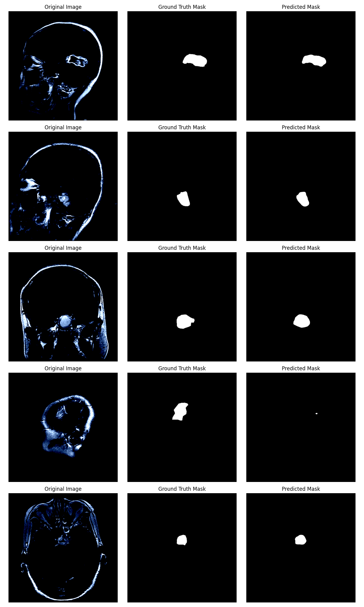

# Brain Tumor Segmentation using Deep Learning

## Overview
This project focuses on **binary brain tumor segmentation**, where the goal is to classify each pixel as tumor or non-tumor. The model is built using **Segmentation Models PyTorch (SMP)** and **Torchvision**, and is trained on a refined version of the **Figshare Brain Tumor Dataset**. Performance is evaluated using **Dice Score, IoU Score, Precision, Recall, and F1-score**.

## Dataset
- **Source**: [Figshare Brain Tumor Dataset](https://figshare.com/articles/dataset/brain_tumor_dataset/1512427)
- **Preprocessing**:
  - Data cleaning and refinement for improved segmentation.
  - Resizing images to a standard resolution.
  - Normalization and augmentation for better generalization.
- **Classes**:
  - **Tumor (1)**
  - **Non-Tumor (0)**

## Model & Methodology
- **Model Architecture**: U-Net with **ResNet encoder** from **Segmentation Models PyTorch (SMP)**
- **Libraries Used**: PyTorch, Torchvision, Segmentation Models PyTorch, NumPy, OpenCV, Matplotlib, Scikit-learn
- **Preprocessing Steps**:
  - Data augmentation techniques (rotation, flipping, brightness adjustments)
  - Splitting dataset into training, validation, and test sets
  - Using **learning rate scheduling** with ReduceLROnPlateau
- **Loss Function**: Dice Loss / Binary Cross-Entropy
- **Optimizer**: Adam

## Evaluation Metrics
- **Dice Score**: Measures the overlap between predicted and ground truth masks.
- **IoU Score (Intersection over Union)**: Evaluates how well the predicted segmentation matches the actual region.
- **Precision**: Measures the accuracy of positive (tumor) predictions.
- **Recall (Sensitivity)**: Evaluates the model’s ability to detect actual tumor regions.
- **F1-score**: Balances precision and recall for overall performance assessment.
- **Additional Metrics for Future Work**:
  - **Hausdorff Distance**: Measures shape similarity between predicted and ground truth masks.
  - **Average Surface Distance (ASD)**: Assesses segmentation boundary differences.
  - **Specificity**: Evaluates how well the model identifies non-tumor regions.

## Future Work & Advanced Architectures
The model's performance is assessed using the mentioned evaluation metrics. Future improvements may include:
- Experimenting with different encoder architectures (e.g., EfficientNet, Transformer-based segmentation models)
- Hyperparameter tuning and increased dataset size
- Implementing **post-processing techniques** to refine segmentation masks
- Visualizing segmentation results with Matplotlib and OpenCV
- Exploring advanced architectures like **TransUNet, SEG-SAM, and MedSegDiff** for better classification and segmentation performance.

The evolution of deep learning in medical image segmentation has led to more powerful architectures which can be used:

- **3D U-Net**: Extends U-Net to three dimensions, capturing volumetric spatial information for enhanced segmentation accuracy.
- **V-Net**: Adapts U-Net for 3D data and employs the **Dice coefficient loss function** instead of cross-entropy loss.
- **TransUNet**: Combines U-Net with Transformers, improving long-range dependency capture for better segmentation.
- **SEG-SAM**: Integrates semantic guidance into the **Segment Anything Model (SAM)** framework, enhancing medical image segmentation.
- **MedSegDiff**: Uses diffusion probabilistic techniques to improve segmentation across medical imaging modalities.
- **HiDiff**: A hybrid approach merging **discriminative segmentation models with generative diffusion models** to refine results.

Additionally, **benchmarking frameworks like MedSegBench** provide standardized evaluation across multiple datasets and imaging modalities, ensuring robust model performance.

## Installation & Usage
### Prerequisites
Ensure you have the following dependencies installed:
```bash
pip install numpy pandas torch torchvision segmentation-models-pytorch opencv-python matplotlib
```

### Running the Model
1. Clone the repository:
   ```bash
   git clone https://github.com/nandnir204/BrainTumourSegmentation.git
   cd brain-tumor-segmentation
   ```
2. Train and Test the model:
   ```bash
   python braintumoursegmentation.py
   ```
## Expected Model Output

Here is an example of the model’s predictions on a sample image:



## Contact
For any queries, reach out to [Nandini Rajoria] at nandinirajoria204@gmail.com.

